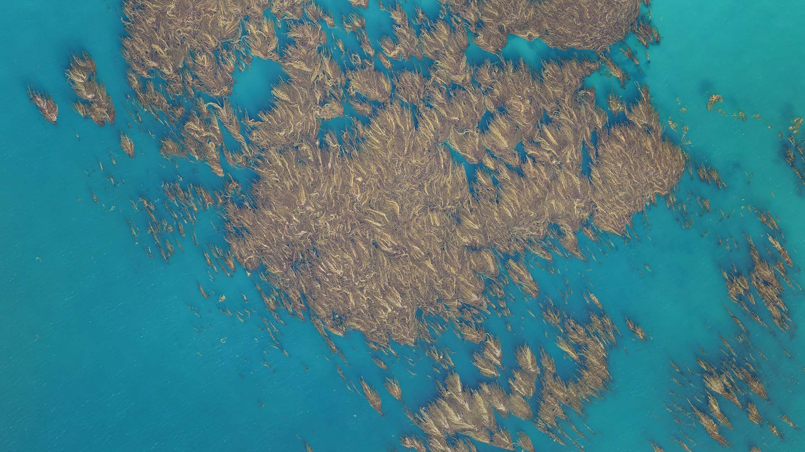

kelp-wanted-competition
======

**Estimating the extent of Giant Kelp Forests by segmenting Landsat imagery**

_Overhead drone footage of giant kelp canopy. Image Credit: Tom Bell, All Rights Reserved._

## Getting started

Read the [Setting up dev environment](https://xultaeculcis.github.io/kelp-wanted-competition/guides/setup-dev-env/).

## Reproducing the results

See the [reproducibility guide](https://xultaeculcis.github.io/kelp-wanted-competition/guides/reproducibility/) for
details.

## Technical report

The technical report is hosted [here](https://xultaeculcis.github.io/kelp-wanted-competition/technical-report/).

## Dev Log

To see in details what was done to train the model please see the
[DEV Log page](https://xultaeculcis.github.io/kelp-wanted-competition/dev-log/).

## How-to guides

On the documentation [page](https://xultaeculcis.github.io/kelp-wanted-competition/) you'll find following How-to guides:

* [Setting up dev environment](https://xultaeculcis.github.io/kelp-wanted-competition/guides/setup-dev-env/)
* [Contributing](https://xultaeculcis.github.io/kelp-wanted-competition/guides/contributing/)
* [Running tests](https://xultaeculcis.github.io/kelp-wanted-competition/guides/tests/)
* [Using Makefile commands](https://xultaeculcis.github.io/kelp-wanted-competition/guides/makefile-usage/)
* [Reproducibility of results](https://xultaeculcis.github.io/kelp-wanted-competition/guides/reproducibility/)
* [Preparing data](https://xultaeculcis.github.io/kelp-wanted-competition/guides/data-prep/)
* [Training models](https://xultaeculcis.github.io/kelp-wanted-competition/guides/training/)
* [MLFlow artifacts](https://xultaeculcis.github.io/kelp-wanted-competition/guides/mlflow-artifacts/)
* [Evaluating models](https://xultaeculcis.github.io/kelp-wanted-competition/guides/evaluation/)
* [Running inference](https://xultaeculcis.github.io/kelp-wanted-competition/guides/inference/)
* [Making submissions](https://xultaeculcis.github.io/kelp-wanted-competition/guides/submissions/)
* [XGBoost](https://xultaeculcis.github.io/kelp-wanted-competition/guides/xgb-stuff/)
* [SAHI](https://xultaeculcis.github.io/kelp-wanted-competition/guides/sahi/)

## Code docs

The code documentation is [here](https://xultaeculcis.github.io/kelp-wanted-competition/api_ref/).
