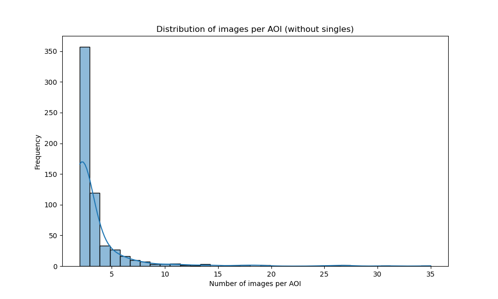

There are a few scripts that run all necessary data preparations for training and inference.

## Sample plotting

This script will plot composite images such as true color, color infrared and shortwave infrared for quick visual
inspection.
It will also generate plots for each image presenting aforementioned composites together with NDVI, DEM, QA Mask and
Kelp Mask.
An example can be seen below:


```shell
make sample-plotting
```

Or:

```shell
python ./kelp/data_prep/sample_plotting.py \
    --data_dir data/raw \
    --metadata_fp data/raw/metadata_fTq0l2T.csv \
    --output_dir data/processed
```

For the same tile following composites are plotted:

* DEM:


* True Color:


* Color Infrared:


* Shortwave Infrared:


## AOI Grouping

This script will group similar images into AOIs (Areas Of Interest) which then can be used to perform Stratified K-Fold
Cross Validation split.

```shell
make aoi-grouping
```

Or:

```shell
python ./kelp/data_prep/aoi_grouping.py \
    --dem_dir data/processed/dem \
    --output_dir data/processed/grouped_aoi_results/sim_th=0.97 \
    --metadata_fp data/raw/metadata_fTq0l2T.csv \
    --batch_size 128 \
    --similarity_threshold 0.97
```

The script will save results in the specified `output_dir`.

```
.
├── final_image_groups_similarity_threshold=0.95.json           <- final list of simalr images
├── intermediate_image_groups_similarity_threshold=0.95.json    <- intermediate result of similarity calculation
├── merged_image_groups_similarity_threshold=0.95.json          <- deduplicated list of similar images
└── metadata_similarity_threshold=0.95.parquet                  <- final metadata parquet file created from the final list of similar images
```

The metadata parquet file is just the metadata CSV file, but with an additional column `aoi_id` denoting the AOI ID.

## EDA

Exploratory Data Analysis scripts are calculating basic statistics about each image and then plotting them as
distribution plots.

Run it with:

```shell
make eda
```

Or:

```shell
python ./kelp/data_prep/eda.py \
    --data_dir data/raw \
    --metadata_fp data/processed/grouped_aoi_results/sim_th=0.97/metadata_similarity_threshold=0.97.parquet \
    --output_dir data/processed/stats_97
```

For each image the script will calculate following statistics:

* `has_kelp` - a flag indicating if the image has kelp in it
* `non_kelp_pixels` - number of non-kelp pixels
* `kelp_pixels` - number of kelp pixels
* `kelp_pixels_pct` - percentage of all pixels marked as kelp
* `high_kelp_pixels_pct` - a flag indicating that the kelp pixels denote over 40% of the whole image
* `dem_nan_pixels` - number of NaN pixels in the DEM layer
* `dem_has_nans` - a flag indicating if DEM layer has NaN values
* `dem_nan_pixels_pct` - percentage of all DEM pixels marked as NaN
* `dem_zero_pixels` - number of zero valued pixels in the DEM layer
* `dem_zero_pixels_pct` - percentage of all DEM pixels with value=zero
* `water_pixels` - estimated number of water pixels (pixels with value <= zero)
* `water_pixels_pct` - percentage of water pixels in the DEM layer
* `almost_all_water` - a flag indicating that over 98% of the DEM layer pixels are water
* `qa_corrupted_pixels` - number of corrupted pixels in the QA band
* `qa_ok` - a flag indicating that no pixels are corrupted in the QA band
* `qa_corrupted_pixels_pct` - percentage of corrupted pixels in the QA band
* `high_corrupted_pixels_pct` - a flag indicating that over 40 % of the QA bands' pixels are corrupted

Calculated statistics will be saved in the specified output directory in parquet format.

Apart from figures, the script will also display and save descriptive statistics such as min, max, median etc.
for each of the numerical statistics.

| statistic | aoi_id   | non_kelp_pixels | kelp_pixels | ... | qa_corrupted_pixels_pct  |
|-----------|----------|-----------------|-------------|-----|--------------------------|
| std       | 662.475  | 2695.318        | 2695.318    | ... | 0.138                    |
| min       | 0        | 8937            | 0           | ... | 0                        |
| mean      | 1479.905 | 121670.837      | 829.163     | ... | 0.07                     |
| max       | 2947     | 122500          | 113563      | ... | 0.999                    |
| count     | 5635     | 5635            | 5635        | ... | 7061                     |
| 75%       | 1895.5   | 122500          | 880         | ... | 0.074                    |
| 50%       | 1407     | 122388          | 112         | ... | 0.013                    |
| 25%       | 1196     | 121620          | 0           | ... | 0.001                    |

Example plots that are generated in this step:

* AOI Images distribution


* AOI Images distribution (filtered - without groups with single image)



* Correlation matrix


* DEM has NaNs


* DEM NaN pixels distribution


* Has Kelp


* High Kelp Pixels distribution


* Kelp Pixels Distribution


* QA corrupted pixels percentage


* QA OK


* Images per Splits


## Calculate band statistics

This script calculates per-band statistics to be used for input image normalization during training and inference.
Spectral indices are automatically appended to the input Tensor, this way stats for all possible channels are computed.

> Note: The script will automatically try to use GPU to speed up calculation. Expect ~45x slowdowns if running on CPU!

Run it with:

```shell
make calculate-band-stats
```

Or:

```shell
python ./kelp/data_prep/calculate_band_stats.py \
    --data_dir data/raw \
    --mask_using_qa \
    --mask_using_water_mask \
    --fill_missing_pixels_with_torch_nan \
    --output_dir data/processed
```

> Note: The script is not perfect - for certain configurations, the resulting statistics can have NaN or Inf in them.
> Please adjust them by manually setting those items to reasonable values.

## Stratified 10-Fold CV split

This script performs stratified 10-fold cross validation split using metadata files generated earlier.

Run it with:

```shell
make train-val-test-split-cv
```

Or:

```shell
python ./kelp/data_prep/train_val_test_split.py \
    --dataset_metadata_fp data/processed/stats/dataset_stats.parquet \
    --split_strategy cross_val \
    --seed 42 \
    --splits 10 \
    --output_dir data/processed
```

> Note: By default `has_kelp`, `almost_all_water`, `qa_ok` and `high_corrupted_pixels_pct` columns are used
> for making stratification column.
