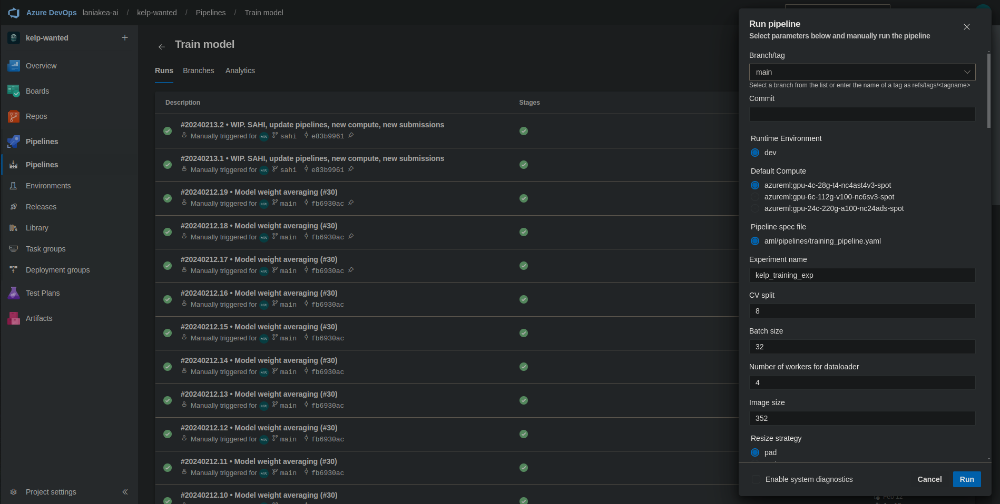
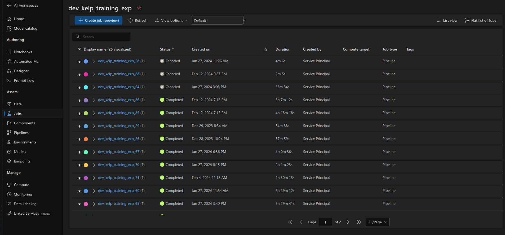
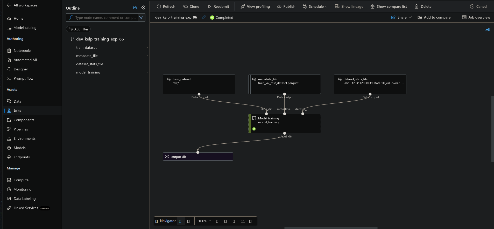
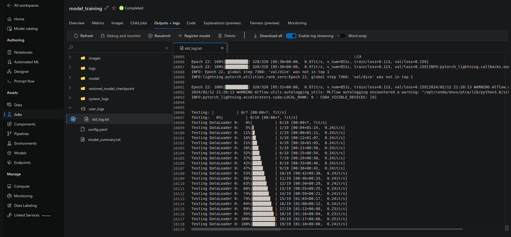
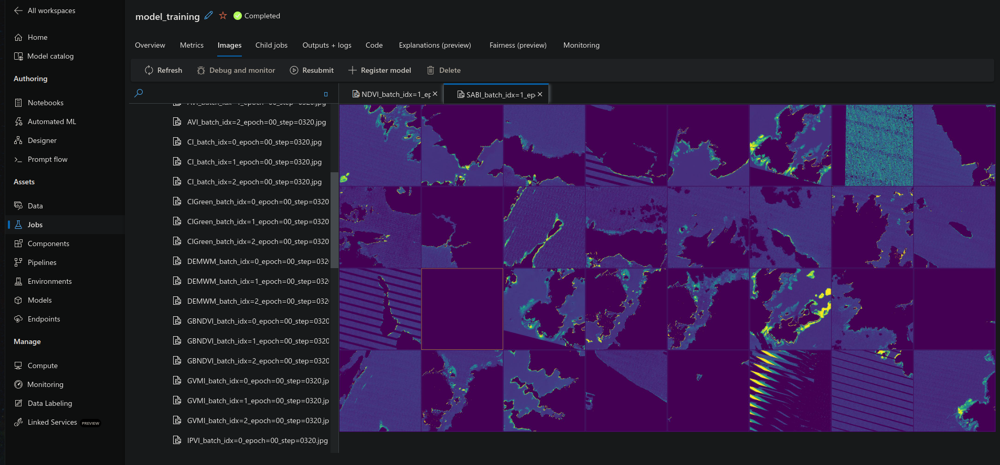
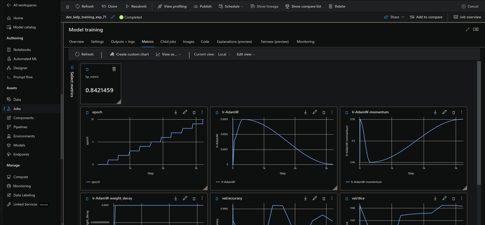
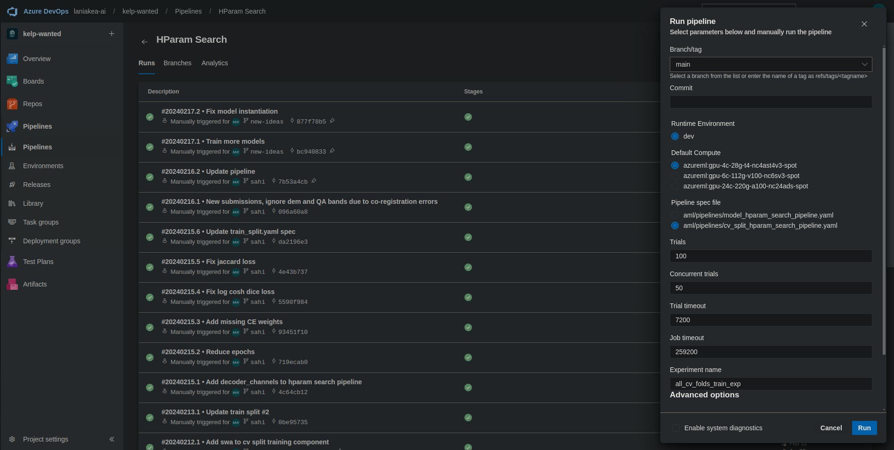
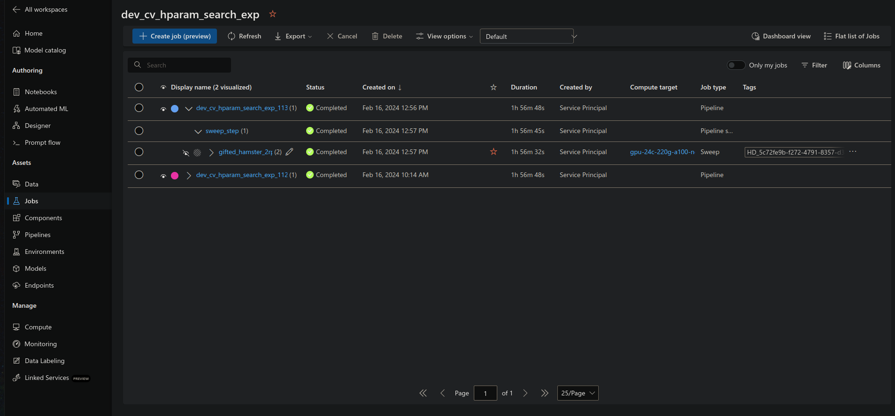
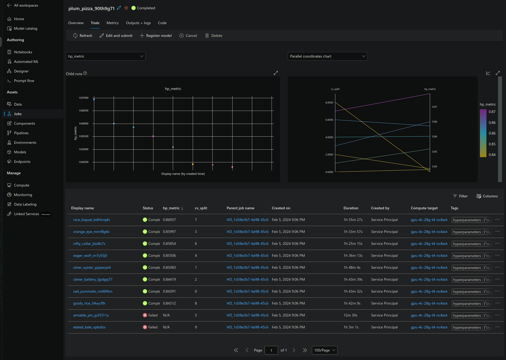
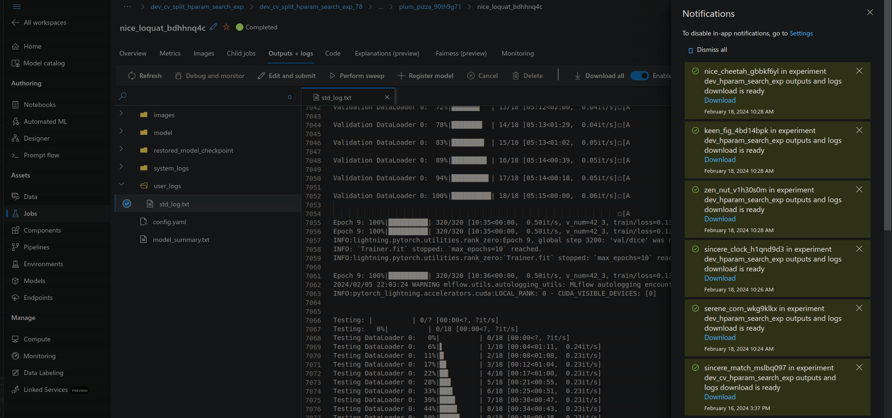

This page contains instructions on how to run model training that was used in the best submission.

## Locally

### Single model

In order to train a single CV fold locally you can run:

```shell
make train FOLD_NUMBER=<fold_number>
```

Or:

```shell
python ./kelp/nn/training/train.py \
    --data_dir data/raw \
    --output_dir mlruns \
    --metadata_fp data/processed/train_val_test_dataset.parquet \
    --dataset_stats_fp data/processed/2023-12-31T20:30:39-stats-fill_value=nan-mask_using_qa=True-mask_using_water_mask=True.json \
    --cv_split $(FOLD_NUMBER) \
    --batch_size 32 \
    --num_workers 4 \
    --bands R,G,B,SWIR,NIR,QA,DEM \
    --spectral_indices DEMWM,NDVI,ATSAVI,AVI,CI,ClGreen,GBNDVI,GVMI,IPVI,KIVU,MCARI,MVI,NormNIR,PNDVI,SABI,WDRVI,mCRIG \
    --image_size 352 \
    --resize_strategy pad \
    --interpolation nearest \
    --fill_missing_pixels_with_torch_nan True \
    --mask_using_qa True \
    --mask_using_water_mask True \
    --use_weighted_sampler True \
    --samples_per_epoch 10240 \
    --has_kelp_importance_factor 3 \
    --kelp_pixels_pct_importance_factor 0.2 \
    --qa_ok_importance_factor 0 \
    --qa_corrupted_pixels_pct_importance_factor -1 \
    --almost_all_water_importance_factor 0.5 \
    --dem_nan_pixels_pct_importance_factor 0.25 \
    --dem_zero_pixels_pct_importance_factor -1 \
    --normalization_strategy quantile \
    --architecture unet \
    --encoder tu-efficientnet_b5 \
    --pretrained True \
    --encoder_weights imagenet \
    --lr 3e-4 \
    --optimizer adamw \
    --weight_decay 1e-4 \
    --loss dice \
    --monitor_metric val/dice \
    --save_top_k 1 \
    --early_stopping_patience 50 \
    --precision 16-mixed \
    --epochs 50 \
    --swa False
```

The training artifacts including:

* Parameters
* Metrics:
    * DICE
    * IOU (Jaccard Index)
    * F1-Score
    * Precision
    * Recall
    * Accuracy
* Sample batch of images and predictions:
    * True color composites
    * Color infrared composites
    * Shortwave infrared composites
    * Spectral indices
    * DEM
    * QA
    * Ground truth masks
    * Predicted masks
* Confusion matrices
* Best and latest model checkpoints

Are automatically logged using [MLFlow](https://mlflow.org/).

See [MLFlow artifacts](mlflow-artifacts.md) to see how those images look like.

### All folds

```shell
make train-all-folds
```

Or:

```shell
make train FOLD_NUMBER=0
make train FOLD_NUMBER=1
...
make train FOLD_NUMBER=9
```

Or:

```shell
python ./kelp/nn/training/train.py \
    --data_dir data/raw \
    ...

python ./kelp/nn/training/train.py \
    --data_dir data/raw \
    ...

...
```

## On Azure ML

> Note: The training details in this section assume you have configured Azure ML Workspace and Azure DevOps Organization
> properly and have all assets, resources, secrets and pipelines in place.

### Single model

Go to your Azure DevOps organization and trigger the Training Pipeline:



Most of the configuration settings can be changed in the ADO portal.

After going to the Azure ML Workspace the new experiment run will appear on the Jobs page.



After clicking on a single job, you'll see the training pipeline.



If you click on the Model Training step you'll see the training job progress, logs and outputs (the same as with local run).



All images as with local run are also logged.



The metrics tab will show all metrics that were logged for training, validation and test phases.



### All folds

Same as with single model training - there is a dedicated pipeline for training all folds under a single Job.



> Note: The same ADO Pipeline can be used to trigger HParam Search Job. In fact the CV fold training pipeline
> under the hood uses Sweep Job to perform training of individual folds.



If you go to the child job of the Sweep Step you'll find the individual fold training jobs.



> Note: Since we are using spot instances, sometimes the training jobs can be interrupted - as seen in the image above.
> In that case you'll need to re-run failed jobs manually.

### Downloading the results

After the training is finished you'll be able to download the outputs and logs of the job. While on **Outputs + logs**
tab, click **Download all** button. All training artifacts will be compressed into zip archive and the download process
should start in a couple of minutes. If it does not - please check the notifications in the portal and click on
download link manually. Once the download finishes, extract the job outputs to the directory of your choosing.


