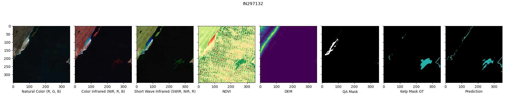
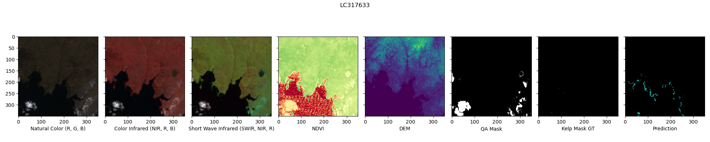
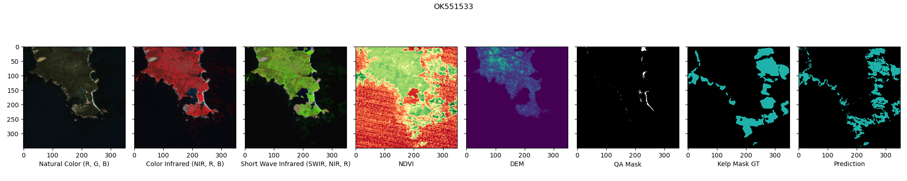
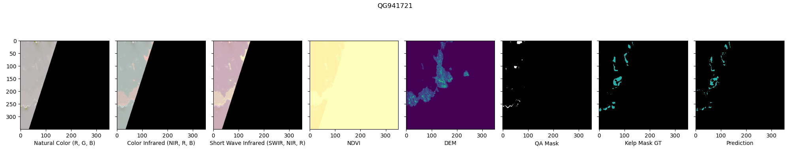
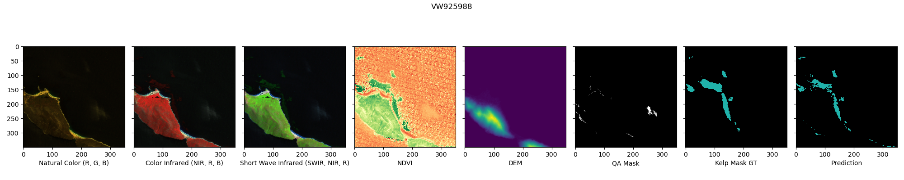
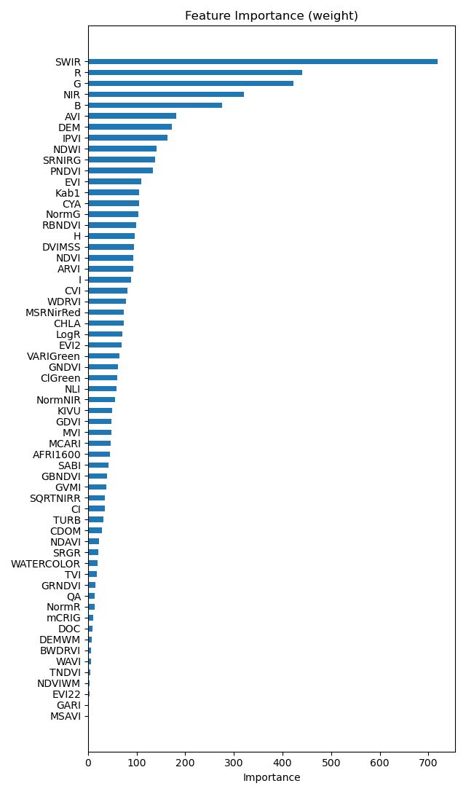
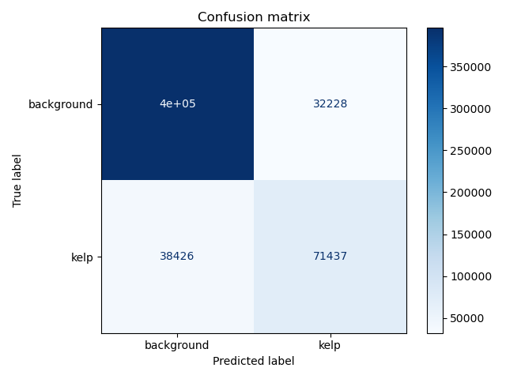
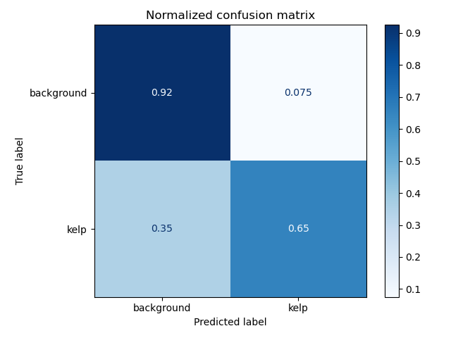
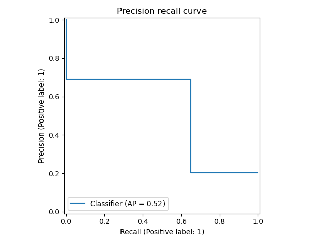
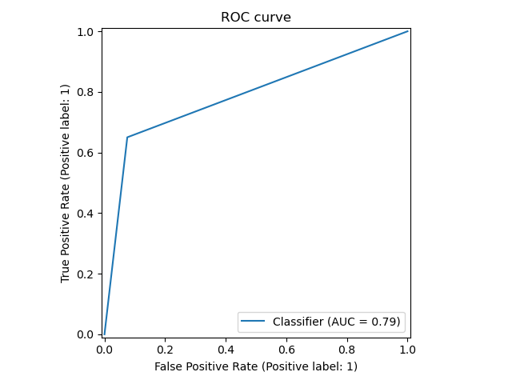

The `XGBoost` model was trained only on 50% of data since local machine only had 32 GB of RAM and loading full dataset
with all spectral indices was not possible. Scaling the training to the cloud was not performed.

## Data prep

For training `XGBoostClassifier` model a pixel-level dataset is needed. Creation of such dataset was done by
buffering the kelp segmentation masks and extracting values for those pixels. A random sample of all pixels was
also added to give model a change to account for inland, corrupted, cloudy and open water pixels.

To create this dataset run:

```shell
python ./kelp/data_prep/dataset_prep.py \
    --data_dir=data/raw/train \
    --metadata_fp=data/processed/stats/dataset_stats.parquet \
    --output_dir=data/processed \
    --train_size=0.95 \
    --test_size=0.5 \
    --buffer_pixels=5 \
    --random_sample_pixel_frac=0.02
```

## Training

```shell
python ./kelp/xgb/training/train.py
    --dataset_fp=data/processed/train_val_test_pixel_level_dataset.parquet \
    --train_data_dir=data/raw/train \
    --output_dir=mlruns \
    --spectral_indices=all \
    --sample_size=0.2 \
    --experiment=train-tree-clf-exp \
    --explain_model
```

## Training results

The best model with all input bands and all spectral indices had public LB score of **0.5125**

Sample predictions:







## Inference

To run inference on test images directory using model from specific `run_dir` use:

```shell
python ./kelp/xgb/inference/predict.py \
    --run_dir=<run_dir> \
    --data_dir=data/raw/test/images \
    --output_dir=data/predictions
```

To create submission run:

```shell
python ./kelp/xgb/inference/predict_and_submit.py \
    --run_dir=<run_dir> \
    --data_dir=data/raw/test/images \
    --output_dir=data/submissions/xgb \
    --preview_submission \
    --preview_first_n=10
```

## Feature importance

The feature importance (weight) is logged by enabling `--explain_model` flag in the training config.



## Logged figures

* Confusion matrices




* Precision-Recall curve



* ROC curve


