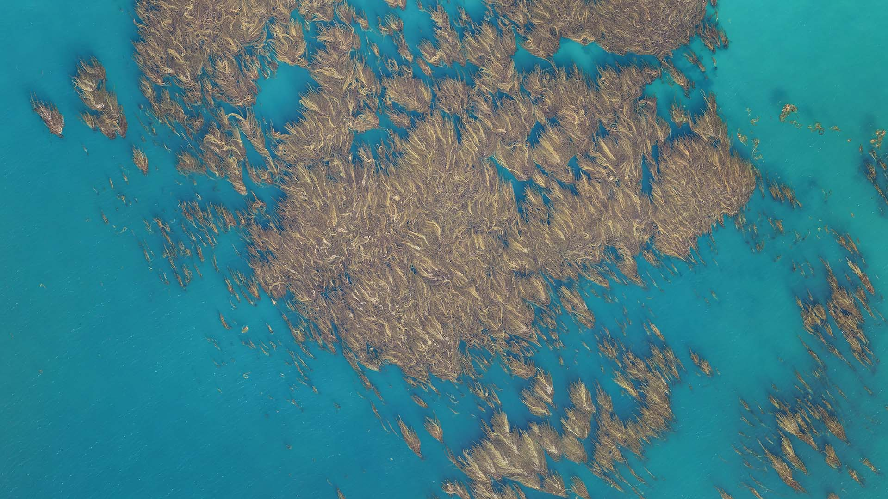
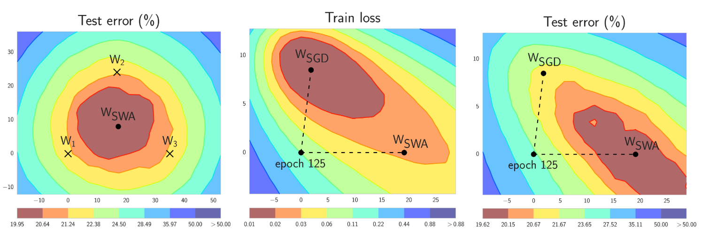

# Kelp Wanted: Segmenting Kelp Forests - 2nd place solution

Username: [xultaeculcis](https://www.drivendata.org/users/xultaeculcis/)

Overhead drone footage of giant kelp canopy. Image Credit: Tom Bell, All Rights Reserved.

## Introduction

In the realm of environmental conservation, the urgency to deploy innovative solutions for monitoring critical
ecosystems has never been more pronounced. Among these ecosystems, kelp forests stand out due to their vital role
in marine biodiversity and their substantial contribution to global economic value. These underwater habitats,
predominantly formed by giant kelp, are foundational to coastal marine ecosystems, supporting thousands of species
while also benefiting human industries significantly. However, the sustainability of kelp forests is under threat
from climate change, overfishing, and unsustainable harvesting practices. The pressing need for effective monitoring
methods to preserve these ecosystems is evident.

In response to this challenge, the
[Kelp Wanted: Segmenting Kelp Forests](https://www.drivendata.org/competitions/255/kelp-forest-segmentation/page/791/)
competition on the [DrivenData](https://www.drivendata.org/) platform presented an opportunity for machine learning
enthusiasts and experts to contribute to the conservation efforts of these vital marine habitats.
The competition aimed to leverage the power of machine learning to analyze coastal satellite imagery,
enabling the estimation of kelp forests' extent over large areas and over time. This innovative approach marks
a significant advancement in the field of environmental monitoring, offering a cost-effective and scalable solution
to understand and protect kelp forest dynamics.

The challenge required participants to develop algorithms capable of detecting the presence or absence of kelp canopy
using [Landsat](https://www.usgs.gov/landsat-missions/landsat-satellite-missions) satellite imagery.
This binary semantic segmentation task demanded not only technical expertise in machine learning and image processing
but also a deep understanding of the environmental context and the data's geospatial nuances.

The competition underscored the importance of applying a combination of advanced machine learning techniques
and domain-specific knowledge to address environmental challenges. The solution, which secured the 2nd place,
leveraged a comprehensive strategy that included the use of pre-trained weights, data preprocessing
methods, and a carefully optimized model architecture. By integrating additional spectral indices,
adjusting the learning strategy, and employing a robust model ensemble, it was possible to achieve significant
accuracy in segmenting kelp forests from satellite imagery.

This report details the methodologies and technologies that underpinned the best submissions.
From data preparation and feature engineering to model development and validation, outlined are the steps
taken to develop a solution proposed approach demonstrates the potential of machine learning to make
a meaningful contribution to environmental conservation efforts, paving the way for further research
and application in this critical field.

The Author extends his deepest gratitude to the organizers of the "Kelp Wanted: Segmenting Kelp Forests" competition,
including [DrivenData](https://www.drivendata.org/), [Kelpwatch.org](https://kelpwatch.org/),
[UMass Boston](https://byrneslab.net/), and [Woods Hole Oceanographic Institution](https://www.whoi.edu/),
for their visionary approach in bridging machine learning with environmental conservation.
Their dedication to addressing the urgent need for innovative solutions in monitoring kelp forests has not only
spotlighted the critical state of these ecosystems but has also paved the way for groundbreaking research and
development. The meticulous organization of the competition, the provision of a rich dataset, and the support offered
throughout the challenge were instrumental in fostering a collaborative and inspiring environment for all participants.
In Author's opinion, this competition has not only contributed significantly to the field of environmental science
but has also empowered the machine learning community to apply their skills for a cause that extends far beyond
technological advancement, aiming for a profound and positive impact on our planet's future.

## TL;DL - solution summary

This section contains a TL;DR summary for the 2nd place solution.

### What worked

* Pre-trained weights
* Reorder channels into R,G,B,SWIR,NIR,QA,DEM
* AdamW instead of Adam or SGD
* Weight decay = 1e-4
* Learning rate = 3e-4
* Batch size = 32 <- full utilization of Tesla T4
* `16-mixed` precision training
* `bf16-mixed` precision inference
* AOI grouping (removing leakage between CV folds)
* Quantile normalization
* Dice Loss
* Weighted sampler @10240 samples per epoch
    * `has_kelp_importance_factor=3.0`
    * `kelp_pixels_pct_importance_factor=0.2`
    * `qa_ok_importance_factor=0.0`
    * `qa_corrupted_pixels_pct_importance_factor=-1.0`
    * `almost_all_water_importance_factor=0.5`
    * `dem_nan_pixels_pct_importance_factor=0.25`
    * `dem_zero_pixels_pct_importance_factor=-1.0`
* Masking indices with QA and DEM Water Mask
* Extra spectral indices:
    * DEMWM,
    * NDVI,
    * ATSAVI,
    * AVI,
    * CI,
    * ClGreen,
    * GBNDVI,
    * GVMI,
    * IPVI,
    * KIVU,
    * MCARI,
    * MVI,
    * NormNIR,
    * PNDVI,
    * SABI,
    * WDRVI,
    * mCRIG
* UNet + EfficientNet-B5 <- best combo
* Decision threshold change to 0.45-0.48
* `OneCycleLR`
* 10-fold CV
* Training for 50 epochs (best model ensemble)
* Mixing models with best DICE per split in the ensemble
* Soft labels (second-best model used them)
* Mixing model architectures and encoders such as:
    * `unet` <- was the best
    * `linknet`
    * `unet++ `
    * `tu-efficeintnet_b5` <- was the best
    * `tu-mobilevitv2_150.cvnets_in22k_ft_in1k_384`
    * `tu-maxvit_small_tf_384.in1k`
    * `tu-seresnextaa101d_32x8d.sw_in12k_ft_in1k`
    * `tu-rexnetr_200.sw_in12k_ft_in1k`
    * `tu-seresnext26d_32x4d`
    * `tu-gcresnet33ts.ra2_in1k`
    * `tu-seresnext101_32x4d`

### What did not work

* Training from scratch
* Larger or smaller `weight_decay`
* Larger or smaller `lr`
* `decoder_attention_type="scse"`
* Losses other than DICE (CE with weighting was close)
* Compiling the model and `torch-ort`
* Normalization strategies other than `quantile` / `z-score`
* Bunch of different index combinations
* TTA (for leaderboard)
* LR Schedulers other than `OneCycleLR`
* Random split
* [XGBoost](guides/xgb-stuff.md) and other tree based models predicting on pixel level
* More decoder channels
* [SAHI](guides/sahi.md)
* Resize strategy different than `pad`
* Training with larger images
* Bigger batches
* More frequent val checks
* Smaller batch sizes and `accumulate_grad_batches` > 1
* Stochastic Weights Averaging (SWA)

### What was not tested

* [Prithvi-100M](https://huggingface.co/ibm-nasa-geospatial/Prithvi-100M) - did not have the time to verify it, also
it was trained on Harmonised Landsat Sentinel 2 (HLS) data - additional data transforms would need to be implemented.
* [The Pretrained Remote Sensing Transformer (Presto)](https://github.com/nasaharvest/presto) - again no time,
also - it requires additional data and was not directly trained on Landsat. Sentinel 2 was the main data source for it.
* Transformer based models such as [Swin transformer](https://arxiv.org/abs/2103.14030)
or [SegFormer](https://arxiv.org/abs/2105.15203) - the dev env was already bloated. Including those models would
mean adding [MMSegmentation](https://github.com/open-mmlab/mmsegmentation) package which has completely different
training configuration than `pytorch-lightning`.

### Best single model

The best single model had private LB score of **0.7264** which would result in 5th place in the final ranking.

> NOTE: All submissions were created using a Linux machine with 8 core AMD CPU, 32 GB RAM, 2TB SSD disk and RTX 3090
> GPU.

The model was a **UNet** with **EfficientNet-B5** encoder pretrained on ImageNet trained in a following fashion:

* Trained with Azure ML using `Standard_NC4as_T4_v3` spot instances (4 cores, 28 GB RAM, 176 GB disk, Tesla T4 GPU with
  16 GB VRAM)
* CV-Fold: #7
* Channel order: R,G,B,SWIR,NIR,QA,DEM
* Additional spectral indices: DEMWM, NDVI, ATSAVI, AVI, CI, ClGreen, GBNDVI, GVMI, IPVI, KIVU, MCARI, MVI, NormNIR,
  PNDVI, SABI, WDRVI, mCRIG
* Default decoder channel numbers
* Batch size: 32
* Accumulate Grad Batches: 1
* Val Check Interval: 1
* Loss: Dice
* Weighted Sampler: @10240 samples / epoch
* Per image weights based on following config:
    * `almost_all_water_importance_factor`: 0.5
    * `dem_nan_pixels_pct_importance_factor`: 0.25
    * `dem_zero_pixels_pct_importance_factor`: -1.0
    * `has_kelp_importance_factor`: 3.0
    * `kelp_pixels_pct_importance_factor`: 0.2
    * `qa_corrupted_pixels_pct_importance_factor`: -1.0
    * `qa_ok_importance_factor`: 0.0
* Image size: 352 (resized using padding)
* Image normalization strategy: `quantile`
* Masking spectral indices with DEMWM and QA
* Replacing missing pixels with `torch.nan`
* Epochs: 10
* Optimizer: AdamW
* Weight decay: 1e-4
* Max learning rate: 3e-4
* Learning rate scheduler: `OneCycleLR`:
    * `onecycle_div_factor`: 2.0
    * `onecycle_final_div_factor`: 100.0
    * `onecycle_pct_start`: 0.1
* Precision: `16-mixed`
* No `torch` ORT or `torch.compile`
* No `benchmark`
* Seed: 42
* Training single model took: ~1:20h

The submission used:

* No TTA
* `bf16-mixed` precision
* Decision threshold = 0.45
* Inference took: ~30s

### Best submissions

Two submissions with the same private LB score of **0.7318** were produced. Both of those were an ensemble
of 10 models, trained on all 10-fold CV splits. Both submission used **the best** checkpoints **not the last** ones.

#### Submission #1

Trained in the same way as the single model submission with following exceptions:

* Epochs increased to 50
* Mixture of all 10 CV-Folds
* Training single model took: ~6-7h

> NOTE: Model trained on fold=5 by mistake was trained for 10 epochs not 50

Inference:

* No soft labels
* No TTA
* Decision threshold for a single model: 0.48
* Ensemble model weights:
    * fold=0: 1.0
    * fold=1: 1.0
    * fold=2: 1.0
    * fold=3: 1.0
    * fold=4: 1.0
    * fold=5: 1.0
    * fold=6: 1.0
    * fold=7: 1.0
    * fold=8: 1.0
    * fold=9: 1.0
* Ensemble decision threshold: 0.48
* Inference took: ~4:10 min

#### Submission #2

Trained in the same way as the single model submission with following exceptions:

* Trained with Azure ML using `Standard_NC24ads_A100_v4` spot instances (24 cores, 220 GB RAM, 64 GB disk, A100 GPU with
  80 GB VRAM)
* 50 epochs
* Loss: Jaccard
* Decoder channels: 512, 256, 128, 64, 32
* `bf16-mixed` precision
* Mixture of all 10 CV-Folds
* Training single model took: ~2h

Inference:

* Soft labels
* No TTA
* `bf16-mixed` precision
* Ensemble model weights:
    * fold=0: 0.666
    * fold=1: 0.5
    * fold=2: 0.666
    * fold=3: 0.88
    * fold=4: 0.637
    * fold=5: 0.59
    * fold=6: 0.733
    * fold=7: 0.63
    * fold=8: 1.0
    * fold=9: 0.2
* Ensemble decision threshold: 0.45
* Inference took: ~4:10 min

#### Private leaderboard scores

In the end 11 submissions had the score that would qualify them as 2nd place solutions - 8 of those had score of over
**0.73**. Furthermore, additional 5 submissions had the same score as the 3rd place solution.

All of those submissions used model ensembles. The best single model was #41 in Author's submissions
with a score of 0.7264. That would have been 5th place solution.

## Code

The code is available on GitHub:
[https://github.com/xultaeculcis/kelp-wanted-competition](https://github.com/xultaeculcis/kelp-wanted-competition)

## Project documentation

Interactive documentation page is available here:
[https://xultaeculcis.github.io/kelp-wanted-competition/](https://xultaeculcis.github.io/kelp-wanted-competition/)

### Dev Log

A detailed development log has been kept during the competition.
You can review what was done to train the model in great detail [here](dev-log.md).

### How-to guides

The best place to start with the solution is to review the How-To guides:

- [Setting up dev environment](guides/setup-dev-env.md)
- [Contributing](guides/contributing.md)
- [Running tests](guides/tests.md)
- [Using Makefile commands](guides/makefile-usage.md)
- [Reproducibility of results](guides/reproducibility.md)
- [Preparing data](guides/data-prep.md)
- [Training models](guides/training.md)
- [MLFlow artifacts](guides/mlflow-artifacts.md)
- [Evaluating models](guides/evaluation.md)
- [Running inference](guides/inference.md)
- [Making submissions](guides/submissions.md)
- [XGBoost](guides/xgb-stuff.md)
- [SAHI](guides/sahi.md)

### API docs

To learn more about how the code is structured and what are its functionalities go to: [Code docs](api_ref/index.md).

## Methodology

This section aims to provide a detailed exposition of the methods employed to tackle the complex task of detecting
kelp canopy presence using satellite imagery. Overall approach was multifaceted, integrating advanced machine learning
techniques with domain-specific insights to develop a robust and effective model.

### Issues during training

Before discussing the methods and techniques used in this solution, the Author would like to acknowledge a few
issues with the presented approach.

1. Misaligned DEM and spectral layers - the misalignment became apparent in the last weeks of the competition,
that being said, aligning the images was not performed since as per competition rules: **"Eligible solutions need
to be able to run on test samples automatically using the test data as provided".** Test set modification was prohibited.
Designing an automated band alignment although possible would not be ideal if additional verification and checks
for the final models were needed. Running alignment on the fly would be too expensive to run for each submission.
2. DICE score discrepancy between local runs and LB - `torchmetrics` package was used for fast on-GPU metrics
calculation. While local DICE scores were in the range 0.84-0.86 the public LB scores were in range 0.70-0.72.
This discrepancy was attributed to the test set having different distribution and possibly higher number of false
positive kelp labels than the training set. Since the scores were consistent over time and increase in local DICE
usually resulted in higher LB scores a decision was made to keep using `torchmetrics` DICE implementation.
After seeing some scores on the competition forum, perhaps further investigation into score alignment issues would
yield better results in the end.
3. The fold number used to compare the locally trained models changed from fold=0 to fold=6 and finally to fold=9.
Fold #0 was used mainly during the baseline training phase, where different trainer and dataloader hyperparameters
were tested. Once all folds were evaluated against public LB - fold #6 was used as it showed the best performance
on public LB. Fold #8 was only used after training larger more capable models with larger amount of samples / epoch
and with larger amount of input channels. Latest submissions were always evaluated against fold #8.
4. Spot instances on Azure ML can be evicted, leading to failed Jobs - in such cases manual Job re-submission is needed.

### Software setup

All experiments were conducted on Linux based machines.
[Azure ML](https://azure.microsoft.com/en-us/products/machine-learning/) was used to scale the training jobs to the
cloud.
Local PC used Ubuntu 22.04 while jobs running on Azure ML used Ubuntu 20.04 based Docker images.
The code is developed using Python. The environment management is performed using `conda` and `conda-lock`. Please
refer to the [Local env setup guide](guides/setup-dev-env.md) for setting up the local development environment.

> NOTE: The dev environment and code was not tested on Windows or macOS.

A short guide on setting up Azure ML Workspace and Azure DevOps organization is available
in [Azure ML reproducibility guide](guides/reproducibility.md#via-azure-ml-aml). Scheduling AML Jobs is described
in [Training on Azure ML guide](guides/training.md#on-azure-ml).

Full list of packages with their versions can be found in the
[conda-lock.yml](https://github.com/xultaeculcis/kelp-wanted-competition/blob/main/conda-lock.yml) file.
Specs for Azure ML Docker based Environment are here:
[acpt_train_env](https://github.com/xultaeculcis/kelp-wanted-competition/tree/main/aml/environments/acpt_train_env)

Some packages that were used for this competition include:

* [pytorch](https://pytorch.org/)
* [torchvision](https://pytorch.org/vision/stable/index.html)
* [pytorch-lightning](https://lightning.ai/docs/pytorch/stable/)
* [kornia](https://kornia.readthedocs.io/en/latest/)
* [rasterio](https://rasterio.readthedocs.io/en/latest/index.html)
* [scikit-learn](https://scikit-learn.org/stable/index.html)
* [pandas](https://pandas.pydata.org/)
* [ttach](https://github.com/qubvel/ttach)
* [segmentation-models-pytorch](https://segmentation-models-pytorch.readthedocs.io/en/latest/index.html)
* [timm](https://github.com/huggingface/pytorch-image-models)
* [dask](https://www.dask.org/)
* [matplotlib](https://matplotlib.org/)

### Hardware setup

For running quick experiments, data preparation, training models and making submissions a local PC with Ubuntu 22.04
was used. This machine was the only one used to make submission files.

Specs:

* OS: Ubuntu 22.04
* Python 3.10 environment with PyTorch 2.1.2 and CUDA 12.1
* CPU: 8-Core AMD Ryzen 7 2700X
* RAM: 32 GB RAM
* Disk: 2 TB SSD
* GPU: RTX 3090 with 24 GB VRAM

Larger training jobs and hyperparameter optimization sweeps were performed on Azure ML using following spot instances:

* **Standard_NC4as_T4_v3**:
    * Ubuntu 20.04 docker image
    * Python 3.8 environment with PyTorch 2.1.2 and CUDA 12.1 (the Azure base image forces py38 usage)
    * 4 cores
    * 28 GB RAM
    * 176 GB disk
    * Tesla T4 GPU with 16 GB VRAM
* **Standard_NC24ads_A100_v4**:
    * Ubuntu 20.04 docker image
    * Python 3.8 environment with PyTorch 2.1.2 and CUDA 12.1 (the Azure base image forces py38 usage)
    * 24 cores
    * 220 GB RAM
    * 64 GB disk
    * A100 GPU with 80 GB VRAM

### Initial Data processing

Before the baseline submission was made, Exploratory Data Analysis (EDA) was performed. Samples were plotted in
various composite configurations together with QA, DEM, NDVI and the Kelp Mask in a single figures. Samples were also
visualized on the map using QGIS. The organizations choose to not include CRS information - probably to eliminate
cheating, where one could use overlapping image extents in order to use leakage for model training. This however
hindered robust train-val-test split strategies.

### Baseline

For baseline a combo of **UNet** architecture
from [Segmentation Model PyTorch](https://github.com/qubvel/segmentation_models.pytorch)
and **ResNet-50** was used. Initially a 10-Fold Stratified Cross Validation was used. Stratification was done using
following per image flag combination: `qa_ok`, `has_kelp`, `dem_has_nans`, `high_corrupted_pixels_pct`.
Band statistics were calculated and `z-score` normalization strategy was used. NDVI was appended to input Tensor.
Pixels with -32k values were filled using `0.0`. Bands used in this model were: SWIR, NIR, R, G, B, QA, DEM and NDVI.
Batch size of 32, no LR Scheduler, training for 10 epochs, without any form of weighted sampler
using `torch.nn.CrossEntropy` loss. The optimizer was set to Adam with 3e-4 learning rate. Since UNet expects the
input tensor W and H dimension to be divisible by 32 the input images were padded to 352x352.
This model (after fixing MLFlow checkpoint loading) achieved **0.6569** on public LB.

### Data fiddling

After it became apparent that there are "duplicates" in the validation datasets - images captured from different
orbits, different platforms or at different times a need for more robust train-test split arose. You can view
sample of "duplicated" images below (DEM layer).

You can see that the same Area of Interest is presented on those images. In order to create robust CV split strategy
each DEM layer was used for embedding generation. DEM layer was chosen for AOI grouping since it does not contain
any striping artifacts, corrupted or saturated pixels or clouds. Missing values in this layer mark the extent of
the DEM layer i.e. DEM only goes couple hundred of meters into the sea - there is no point in calculating DEM over
the water. Missing values were replaced with zeroes. Every DEM image was passed through a pre-trained ResNet network.
The resulting embeddings were then compared  with each other - if cosine similarity between two images was over 0.97
they were placed into a single group. The de-duplication resulted in 3313 unique AOI groups. Those groups where
then used to perform 10-Fold Stratified CV Split.

What's more a few images had been mislabelled as kelp. Those images were filtered out from the training dataset.

Input channels were also re-ordered so that the first channels match those used by pre-trained networks trained on
ImageNet and other natural-image datasets. **R, G, B, SWIR, NIR, QA, DEM** band order consistently outperformed
the default **SWIR, NIR, R, G, B, QA, DEM** by a small margin - val/dice **0.760** vs **0.762**

### Extra channels - spectral indices

In Author's other projects utilization of additional input channels such as NDVI, EVI, Water Masks and other proved
to greatly bump model predictive capabilities. To see a list of all implemented spectral indices see the
[indices page](api_ref/core/indices.md).

The best models all used 17 extra spectral indices appended to the input tensor of **R, G, B, SWIR, NIR, QA, DEM**
bands:
**DEMWM, NDVI, ATSAVI, AVI, CI, ClGreen, GBNDVI, GVMI, IPVI, KIVU, MCARI, MVI, NormNIR, PNDVI, SABI, WDRVI, mCRIG**.

To see more visualization of those indices refer to
[MLFlow spectral indices artifacts guide](guides/mlflow-artifacts.md#spectral-indices).

### Normalization strategy

Following normalization strategies were evaluated early on using split=6:

* `z-score`: **0.834168**
* `quantile`: **0.834134**
* `min-max`: **0.831865**
* `per-sample-quantile`: **0.806227**
* `per-sample-min-max`: **0.801893**

In the end `quantile` normalization was used since it produces the most appealing visual samples and was more robust
against outliers, the learning curve also seemed to converge faster. The idea behind quantile normalization is rather
simple instead of using global min-max we calculate quantile values for q01 and q99. During training Min-Max
normalization
is used.

You can view the effects of normalization strategies in the figures below.

* Z-Score:

* Quantile:

* Min-Max:

* Per-Sample Min-Max:

* Per-Sample Quantile:

Additionally, replacing corrupted, missing and land pixels with `0.0` and `torch.nan` was tested. Masking
with `torch.nan`
was better than using zeroes (Public LB  **0.7062** vs **0.7083**). A rationale here is that using zeroes can
lead to suboptimal normalization. Masking with `torch.nan` is performed instead.
After the spectral indices are calculated and appended to the input tensor, for each channel the `nan` and `-inf`
pixels are replaced with minimal value for each channel, while `inf` pixels are replaced with maximal value per channel.
Masking land and corrupted pixels in indices bumps the performance by over 1-2%

### Loss functions

Various loss functions were evaluated:

* `torch.nn.CrossEntropyLoss` (`weight=[0.4,0.6]`)
* `smp.losses.DiceLoss`
* `smp.losses.JaccardLoss`
* `smp.losses.TverskyLoss`
* `torch.nn.CrossEntropyLoss` (`weight=[0.3,0.7]`)
* `torch.nn.CrossEntropyLoss` (`weight=None`)
* `smp.losses.SoftCrossEntropyLoss` (`smooth_factor=0.1`))
* `smp.losses.FocalLoss`
* `smp.losses.LovaszLoss`
* `smp.losses.SoftCrossEntropyLoss` (`smooth_factor=0.2`)
* `smp.losses.SoftCrossEntropyLoss` (`smooth_factor=0.3`)
* `torch.nn.CrossEntropyLoss` (`weight=[0.1,0.9]`)
* `kelp.nn.models.losses.XEDiceLoss`
* `kelp.nn.models.losses.ComboLoss`
* `kelp.nn.models.losses.LogCoshDiceLoss`
* `kelp.nn.models.losses.HausdorffLoss`
* `kelp.nn.models.losses.TLoss`
* `kelp.nn.models.losses.ExponentialLogarithmicLoss`
* `kelp.nn.models.losses.SoftDiceLoss`
* `kelp.nn.models.losses.BatchSoftDice`

In the end Dice loss was used, since it performed best on public leaderboard. The best two model ensembles with
the same private LB score of 0.7318 used **DICE** and **Jaccard** losses respectively.

### Weighted sampler

Since over 2000 images do not have any kelp pixels in them. It was apparent that those images will not contribute
to the training very much. Weighted Sampler was then used and adjusted via hparam search on Azure ML.

Following metadata stats and flags were used to determine the optimal per-image weight:

* `has_kelp` - a flag indicating if the image has kelp in it
* `kelp_pixels_pct` - percentage of all pixels marked as kelp
* `dem_nan_pixels_pct` - percentage of all DEM pixels marked as NaN
* `dem_zero_pixels_pct` - percentage of all DEM pixels with value=zero
* `almost_all_water` - a flag indicating that over 98% of the DEM layer pixels are water
* `qa_ok` - a flag indicating that no pixels are corrupted in the QA band
* `qa_corrupted_pixels_pct` - percentage of corrupted pixels in the QA band

* Some results after whole night of training:

| samples_per_epoch | has_kelp | kelp_pixels_pct | qa_ok | qa_corrupted_pixels_pct | almost_all_water | dem_nan_pixels_pct | dem_zero_pixels_pct | val/dice |
|-------------------|----------|-----------------|-------|-------------------------|------------------|--------------------|---------------------|----------|
| 5120              | 2        | 0.5             | 0.5   | -0.5                    | -1               | 0                  | -0.25               | 0.84405  |
| 5120              | 0.2      | 0               | -0.5  | -0.5                    | -0.5             | 0.25               | 0.5                 | 0.84402  |
| 5120              | 3        | 0.5             | -1    | 0                       | -1               | 0.25               | 0                   | 0.84396  |
| 5120              | 3        | 0.2             | 0     | -1                      | 0.5              | 0.25               | -1                  | 0.84396  |
| 5120              | 2        | 0               | 0.5   | 0                       | 0.25             | 0                  | -0.5                | 0.84391  |
| 5120              | 0.5      | 0.2             | -0.5  | 0.75                    | 0.5              | -1                 | -0.25               | 0.84390  |
| 5120              | 3        | 0.2             | 0.5   | -0.25                   | 0.75             | -0.25              | 0.5                 | 0.84382  |
| 5120              | 3        | 0.5             | 1     | -0.25                   | 0.5              | -0.5               | 0                   | 0.84382  |
| 5120              | 3        | 2               | -0.25 | -0.5                    | -0.5             | -1                 | 0.75                | 0.84380  |
| 5120              | 2        | 1               | 0.25  | -1                      | 0.75             | 0.75               | 1                   | 0.84377  |
| 5120              | 2        | 0               | -0.5  | 0                       | -1               | -1                 | -1                  | 0.84374  |
| 5120              | 0.5      | 0               | -1    | -0.25                   | 0.25             | -0.25              | -0.5                | 0.84373  |
| 5120              | 0.2      | 0               | 0     | 0.25                    | -1               | 0.25               | 0.5                 | 0.84370  |
| 5120              | 2        | 0.5             | 0.25  | -0.5                    | 0.25             | 0.5                | -0.5                | 0.84369  |

* After retraining using 10240 samples per epoch:

| samples_per_epoch | has_kelp | kelp_pixels_pct | qa_ok | qa_corrupted_pixels_pct | almost_all_water | dem_nan_pixels_pct | dem_zero_pixels_pct | val/dice |
|-------------------|----------|-----------------|-------|-------------------------|------------------|--------------------|---------------------|----------|
| 10240             | 2        | 0.5             | 0.5   | -0.5                    | -1               | 0                  | -0.25               | 0.84459  |
| 10240             | 0.2      | 0               | -0.5  | -0.5                    | -0.5             | 0.25               | 0.5                 | 0.84456  |
| 10240             | 3        | 0.5             | -1    | 0                       | -1               | 0.25               | 0                   | 0.84501  |
| 10240             | 3        | 0.2             | 0     | -1                      | 0.5              | 0.25               | -1                  | 0.84801  |
| 10240             | 2        | 0               | 0.5   | 0                       | 0.25             | 0                  | -0.5                | 0.84641  |
| 10240             | 0.5      | 0.2             | -0.5  | 0.75                    | 0.5              | -1                 | -0.25               | 0.84622  |
| 10240             | 3        | 0.2             | 0.5   | -0.25                   | 0.75             | -0.25              | 0.5                 | 0.84546  |
| 10240             | 3        | 0.5             | 1     | -0.25                   | 0.5              | -0.5               | 0                   | 0.84619  |
| 10240             | 3        | 2               | -0.25 | -0.5                    | -0.5             | -1                 | 0.75                | 0.84500  |
| 10240             | 2        | 1               | 0.25  | -1                      | 0.75             | 0.75               | 1                   | 0.84508  |
| 10240             | 2        | 0               | -0.5  | 0                       | -1               | -1                 | -1                  | 0.84430  |
| 10240             | 0.5      | 0               | -1    | -0.25                   | 0.25             | -0.25              | -0.5                | 0.84496  |
| 10240             | 0.2      | 0               | 0     | 0.25                    | -1               | 0.25               | 0.5                 | 0.84522  |
| 10240             | 2        | 0.5             | 0.25  | -0.5                    | 0.25             | 0.5                | -0.5                | 0.84538  |

Training for 10240 samples / epoch yielded better results. Assigning higher importance to `has_kelp` flag while keeping
the `almost_all_water` flag low and even negative was the best combination. Zeroes and NaN values in the DEM layer
seemed to not be important as much - weights for those stats usually ranged from -0.25 - 0.25. The QA band stats
seemed also to be only slightly important with weights being in rage -1.0 - 1.0.

For public LB following configuration worked the best:

* 10240 samples / epoch
* `has_kelp_importance_factor=3.0`
* `kelp_pixels_pct_importance_factor=0.2`
* `qa_ok_importance_factor=0.0`
* `qa_corrupted_pixels_pct_importance_factor=-1.0`
* `almost_all_water_importance_factor=0.5`
* `dem_nan_pixels_pct_importance_factor=0.25`
* `dem_zero_pixels_pct_importance_factor=-1.0`

### Training configuration

Multiple training configurations were tested out including:

* Training from scratch - very slow convergence, training using pre-trained model is a must in this case.
  Final DICE after 10 epochs=**0.736**, compared to **0.760** with `imagenet` weights
* Optimizers: Adam, SGD, AdamW - in the end AdamW was the best on local validation set -> +0.02 for AdamW
* OneCycleLR vs no LR scheduler: **0.76640** vs **0.764593** but overall stability is better with 1Cycle
* `weight_decay`:
    * 1e-2: **0.759**
    * 1e-3: **0.763**
    * 1e-4: **0.765**
    * 1e-5: **0.762**
* Tried to add `decoder_attention_type="scse"` but it gives worse performance (val/dice=**0.755**)
* Learning rate set to 3e-4 worked best locally
* UNet required images to be divisible by 32 - resized the input images to 352x352 using zero-padding - during the
  inference the padding is removed
* Using other resize strategies and image sizes did not generate better results
* Batch size of 32 was selected mainly to keep Tesla T4 GPUs fully saturated, almost at the edge of running into OOM errors
* Training with `batch_size=8` and `accumulate_grad_batches=4` resulted in better local eval scores,
  but did not improve leaderboard scores
* The train augmentations were rather simple:
    * Random Horizontal Flip
    * Random Vertical Flip
    * Random Rotation 0-90 deg.
* Using Random Resized Crops did not work better than the base augmentations mentioned above
* Transforms (including appending spectral indices) were performed on batch of images on GPU using
  [kornia](https://kornia.readthedocs.io/en/latest/index.html) library
* Compiling the model using `torch-ort` or `torch.compile` did not yield much of speedups, in some configurations
the compilation phase took 50% of training time - in this case it is better suited for large multi-day and multi-GPU
training runs where those few % of speedup can really be beneficial.

### TTA

Test time augmentations were also tested. [ttach](https://github.com/qubvel/ttach) library was used for it. Following
augmentations were used during testing:

* Vertical flip
* Horizontal flip
* Rotation: 0, 90, 180, 270

Results with different `tta_merge_mode`:

* Baseline (no TTA) val/dice=0.85339:
* max: **0.85490**
* mean: 0.85458
* sum: 0.85458
* min: 0.85403
* gmean: 0.15955
* tsharpen: 0.00468 - loss was nan

On public LB:

* no-tta: 0.7083
* max: 0.7076
* mean: 0.7073

Decided that TTA was not working and never used it again...

### Thresholding

Multiple decision threshold were verified on local validation set.

| threshold | val/dice    |
|-----------|-------------|
| 0.3       | 0.85301     |
| 0.31      | 0.85305     |
| 0.32      | 0.85306     |
| 0.33      | 0.85307     |
| 0.34      | 0.85309     |
| 0.35      | 0.85314     |
| 0.36      | 0.85314     |
| 0.37      | 0.85313     |
| 0.38      | 0.85315     |
| 0.39      | 0.85317     |
| 0.4       | 0.85316     |
| 0.41      | 0.85317     |
| 0.42      | 0.85317     |
| 0.43      | 0.85320     |
| 0.44      | 0.85319     |
| 0.45      | **0.85320** |
| 0.46      | 0.85318     |
| 0.47      | 0.85314     |
| 0.48      | 0.85316     |
| 0.49      | 0.85317     |
| 0.5       | 0.85316     |
| 0.51      | 0.85315     |
| 0.52      | 0.85314     |
| 0.53      | 0.85313     |
| 0.54      | 0.85311     |
| 0.55      | 0.85309     |
| 0.56      | 0.85305     |
| 0.57      | 0.85303     |
| 0.58      | 0.85300     |
| 0.59      | 0.85300     |
| 0.6       | 0.85296     |
| 0.61      | 0.85296     |
| 0.62      | 0.85290     |
| 0.63      | 0.85287     |
| 0.64      | 0.85285     |
| 0.65      | 0.85281     |
| 0.66      | 0.85278     |
| 0.67      | 0.85274     |
| 0.68      | 0.85267     |
| 0.69      | 0.85259     |
| 0.7       | 0.85253     |

* Leaderboard using **dt=0.45**: 0.7077

### Model Architectures and Encoders

Various Model architectures and encoders were tested to find the best performing ones. Azure ML Sweep Job was used to
verify encoder + architecture pairs. The encoders came from both
[segmentation-models-pytorch](https://github.com/qubvel/segmentation_models.pytorch)
and [timm](https://github.com/huggingface/pytorch-image-models) libraries.
A sample job results are visible below.

General observations:

* ResUnet++ often results in `NaN` loss.
* Unet and Unet++ often were the best.
* Unet++ training was not deterministic even though `pl.seed_everything(42)` was used
* Bigger models often resulted in OOM errors during training - had to reduce batch size and apply gradient accumulation
* Some models expected the input image to be divisible by 8, 24, 128 etc. - the training config class had to be
  adjusted to change the input `image_size` parameter to allow for training those models.
* In general bigger models worked better
* FCN - model collapses
* ConvNext and SWIN Transformer models not supported
* The best combo was **UNet** + **EfficientNet-B5**

Results after overnight training on split=6 (Top 5 runs only):

| encoder               | architecture | val/dice |
|-----------------------|--------------|----------|
| tu-efficientnet_b5    | unet         | 0.85854  |
| tu-seresnext101_32x4d | unet         | 0.85807  |
| tu-resnest50d_4s2x40d | unet         | 0.85787  |
| tu-rexnetr_300        | unet         | 0.85749  |
| tu-seresnext26d_32x4d | unet         | 0.85728  |

As you might have noticed in the screenshot in the [Private leaderboard](#private-leaderboard-scores) subsection
some of the top performing model ensembles used a mixture of EfficientNet, SE-ResNext, ReXNet-R and other encoders
trained as part of LinkNet, UNet and UNet++ architectures. Although, best two submissions used an ensemble of just
UNet + EfficientNet-B5 models.

### Stochastic Weights Averaging (SWA)

SWA was one of the last things that were tested during the competition. In short, SWA performs an equal average of the
weights traversed by SGD with a modified learning rate schedule
(see the left panel of figure below). SWA solutions end up in the center of a wide flat region of loss,
while SGD tends to converge to the boundary of the low-loss region, making it susceptible to the shift between
train and test error surfaces (see the middle and right panels of figure below).

Source: [Stochastic Weight Averaging in PyTorch](https://pytorch.org/blog/stochastic-weight-averaging-in-pytorch/)
Illustrations of SWA and SGD with a Preactivation ResNet-164 on CIFAR-100 [1].
Left: test error surface for three FGE samples and the corresponding SWA solution (averaging in weight space).
Middle and Right: test error and train loss surfaces showing the weights proposed by SGD (at convergence) and SWA,
starting from the same initialization of SGD after 125 training epochs. Please see [1] for details on how these
figures were constructed.

The figure below presents and illustration of the learning rate schedule adopted by SWA. Standard decaying schedule
is used for the first 75% of the training and then a high constant value is used for the remaining 25%.
The SWA averages are formed during the last 25% of training.

The best model ensemble trained with SWA had public and private LB score of 0.7159 and 0.7285 respectively - thus,
was not the best. Best single model with SWA had public and private LB score of 0.7147 and 0.7226 respectively.

[1] Averaging Weights Leads to Wider Optima and Better Generalization;
Pavel Izmailov, Dmitry Podoprikhin, Timur Garipov, Dmitry Vetrov, Andrew Gordon Wilson;
Uncertainty in Artificial Intelligence (UAI), 2018

### XGBoost

Another idea that did not work was training XGBoost Classifier on all channels and spectral indices.
The goal was not to use XGBoost to establish channel and spectral index importance, but rather completely replace the
deep learning approach with classical tree-based model. Unfortunately best models on public LB had score
of 0.5125. Which was way too low to try to optimize. Since predictions are done per pixel, TTA cannot be usd.
Optimizing decision threshold did not improve the scores much. Even applying post-processing operations
such as erosion or dilution would not bump the performance by 20 p.p.

Sample predictions:

If you want to learn more about XGBoost approach and to reproduce the results,
please see: [XGBoost guide](guides/xgb-stuff.md).

The XGB feature importance at least gave the Author confidence that the original approach with appending spectral
indices to the input tensor was somewhat justified.

### SAHI

Slicing Aided Hyper Inference or SAHI is a technique that helps overcome the problem with detecting and segmenting
small objects in large images by utilizing inference on image slices and prediction merging.
Because of this it is slower than running inference on full image but at the same time usually ends up
having better performance, especially for smaller features.

This was the last idea that was tested.

Source: [https://github.com/obss/sahi](https://github.com/obss/sahi)

The idea was simple:

1. Generate sliced dataset of small 128x128 non-overlapping tiles from the bigger 350x350 input images
2. Use this dataset to train new model
3. During training resize the crops to e.g. 320x320 resolution and train on those
4. When running inference generate overlapping tiles, inference on those tiles, and merge the predicted masks
   by averaging the predictions in the overlapping areas
5. Profit?

A sample of small tiles used for training are visualized below:

Best model trained on **128x128** crops with **320x320 resize** and **nearest interpolation**
resulted in public LB score of: **0.6848**. As it turns out, the input time size of 350x350 is already too
small for SAHI to shine. Sliced inference did not result in any meaningful bump in performance.

If you want to learn more about SAHI approach and to reproduce the results,
please see: [SAHI guide](guides/sahi.md).

### Ensemble

Averaging model predictions was a natural step to take in the later stages of the competition. The prediction scripts
were written in a way to allow to optimize both decision threshold and usage of TTA. The final prediction
averaging was done using per-model weights. The weights were obtained by using `MinMaxScaler` with feature range
if `(0.2, 1.0)` on public LB scores obtained for each model. This resulted with following weights:

| Fold # | Public LB Score | Calculated Weight |
|--------|-----------------|-------------------|
| 0      | 0.7110          | 0.666             |
| 1      | 0.7086          | 0.5               |
| 2      | 0.7110          | 0.666             |
| 3      | 0.7139          | 0.88              |
| 4      | 0.7106          | 0.637             |
| 5      | 0.7100          | 0.59              |
| 6      | 0.7119          | 0.733             |
| 7      | 0.7105          | 0.63              |
| 8      | 0.7155          | 1.0               |
| 9      | 0.7047          | 0.2               |

2nd best submission used those weights. The best submission used following weights:

| Fold # | Public LB Score | Calculated Weight |
|--------|-----------------|-------------------|
| 0      | 0.7110          | 1.0               |
| 1      | 0.7086          | 1.0               |
| 2      | 0.7110          | 1.0               |
| 3      | 0.7139          | 1.0               |
| 4      | 0.7106          | 1.0               |
| 5      | 0.7100          | 1.0               |
| 6      | 0.7119          | 1.0               |
| 7      | 0.7105          | 1.0               |
| 8      | 0.7155          | 1.0               |
| 9      | 0.7047          | 1.0               |

Model stacking was not performed.

### Soft labels

Once the ensemble prediction pipeline was in place soft label prediction was implemented. Using soft labels
is rather simple - instead of using hard labels i.e. 0 - for `no kelp` and 1 for `kelp` we use probability of
certain pixel belonging to `kelp` class. We can then use weighted average and decision threshold adjustment to make
final prediction.

As seen in the LB screenshot in the [Private LB scores](#private-leaderboard-scores) subsection, most of the top performing
submissions used soft labels - the 2nd best submission included.

## Conclusion

In this highly competitive and challenging contest, approach to segmenting kelp forests using Landsat satellite
imagery and deep learning has demonstrated the power of combining advanced machine learning techniques with
domain-specific knowledge. Used methodology was propelled to the second place, showcasing a robust and effective
solution for the critical environmental task of mapping and monitoring kelp canopy presence.

The utilization of pre-trained weights laid a strong foundation, allowing the models to learn from relevant,
pre-existing patterns, significantly accelerating the learning process. The introduction of the
Normalized Difference Vegetation Index (NDVI) and other spectral indices such as ATSAVI, AVI, CI, and more,
provided the models with enhanced capabilities to distinguish between kelp and non-kelp regions effectively.
These indices, especially when coupled with strategy of reordering channels to align more closely with natural
and scientific observations, significantly improved model performance.

Decision to employ AdamW optimizer, accompanied by a carefully chosen weight decay and learning rate scheduler,
further optimized the training process, striking a fine balance between fast convergence and avoiding overfitting.
The choice of a 32 batch size fully leveraged the computational capacity of the Tesla T4 GPUs, ensuring efficient
use of resources.

The implementation of mixed-precision training and inference not only reduced model's memory footprint
but also accelerated its computational speed, making the solution both effective and efficient. By adopting
a weighted sampler with a tailored importance factor for each type of pixel, the models could focus more on
significant areas, reducing the bias towards dominant classes.

The UNet architecture, augmented with an EfficientNet-B5 encoder, proved to be the best combination for the task,
striking an excellent balance between accuracy and computational efficiency. Adjusting the decision threshold
allowed for fine-tuning the model's sensitivity to kelp presence, which was crucial for achieving high
evaluation scores.

Comprehensive approach, which included ten-fold cross-validation, training models for 50 epochs,
and creating an ensemble of the best-performing models, ensured that the solution was not only robust across
different data splits but also generalized well to unseen data.

To conclude, this work underscores the potential of machine learning to contribute significantly to
environmental conservation efforts. By employing a mix of sophisticated techniques, from spectral analysis
to advanced deep learning models, a scalable and accurate method for monitoring kelp forests was developed.
This solution not offers a practical tool for ecosystem management and conservation. Success of Deep Learning
approach in this challenge reaffirms the importance of machine learning in addressing some  of the most pressing
environmental issues of our time.
